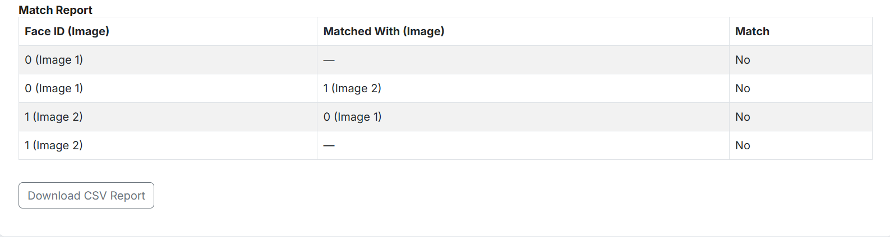

# Face Comparison Web App

<<<<<<< HEAD
---

## 🧠 Team Name & Member

**Team Name**: Mnitian\_Coder  
**Team Member**: Govind Ram Mali

---

## 🎯 Problem Statement / Objective

Build an app that can compare faces across three or more images and identify which faces match and which ones are different. You’ll design a tool that detects faces, analyzes them, and highlights duplicates or unique individuals between photos

---

## 🛠 Tools & Technologies Used

| Category      | Tools & Libraries                     |
| ------------- | ------------------------------------- |
| Backend       | Python, Flask, DeepFace, OpenCV       |
| Frontend      | React.js, HTML, CSS, JavaScript       |
| Tunneling     | pyngrok                               |
| Face Matching | Facenet (DeepFace), Cosine Similarity |
| Data Format   | pandas, CSV                           |
| Environment   | Python 3.8+, VS Code                  |

---

## 🚀 How to Run the Project

### 1. Clone the Repository

```bash
git clone https://github.com/your-username/face-comparison-app.git
cd face-comparison-app
```

### 2. Install Python Dependencies

Ensure Python 3.8 or above is installed.

```bash
pip install -r requirements.txt
pip install pyngrok
```

### 3. Run the Flask Server

```bash
python app.py
```

This will start a local Flask server and expose it using ngrok.
You'll see something like:

```
 * ngrok tunnel available at: http://abcd1234.ngrok.io
```

### 4. Update Frontend API URL

Open your frontend `index.html` or React component and **replace the existing API URL** with the new one from ngrok:

```javascript
const API_URL = "http://abcd1234.ngrok.io/compare";  // Use your actual tunnel URL
```

Do this each time you rerun `python app.py`.

### 5. Launch the Frontend

If using React:

```bash
npm install
npm start
```

Or if using static HTML:

* Open `index.html` in your browser, or
* Use VS Code Live Server Extension.

### 6. Use the App

* Upload 2 or more images with faces.
* Click **"Compare"**.
* View:

  * Annotated images with face IDs (e.g., "image1 - ID: 3").
  * A tabular match report showing which face in one image matches a face in another. Example:

    * *image1 - ID: 3* matched with *image2 - ID: 2* → **Match: Yes**
    * *image1 - ID: 1* has no match in image2 → **Match: No**
  * Downloadable CSV report including match details.

---

## 🖼 Screenshots


### 🔍 Annotated Face Detection Output

*(Add your image here)*

### 📊 CSV Report Preview

| Face ID (Image) | Matched With (Image) | Distance | Match |
| --------------- | -------------------- | -------- | ----- |
| 3 (Image 1)     | 2 (Image 2)          | 0.34     | Yes   |
| 1 (Image 1)     | —                    | —        | No    |

---

## 📂 Project Structure

```
├── app.py                # Flask backend
├── index.html / React    # Frontend UI
├── requirements.txt      # Python dependencies
├── face_compare.ipynb    # Optional notebook
├── screenshots/          # For storing screenshot images
└── README.md             # Project documentation
```

---

## 📄 License

This project is licensed under the **MIT License**.
See the [LICENSE](./LICENSE) file for more information.
=======
This is a Flask-based face comparison tool powered by DeepFace that allows users to upload multiple images, automatically detect faces, compare them, assign unique IDs to matched faces, and visualize results with annotated images and a downloadable match report.

---

## 🚀 Features

- Upload 2 or more images.
- Detect all faces in each image.
- Assign unique IDs to matched faces.
- Compare using *Facenet + Cosine similarity*.
- Annotated images with bounding boxes and face IDs.
- View tabular match report.
- Download CSV report with distances and match results.

---

## 📦 Tech Stack

| Layer     | Tools Used                         |
|-----------|------------------------------------|
| Backend   | Python, Flask, DeepFace, OpenCV    |
| Frontend  | HTML, CSS, JavaScript (vanilla)    |
| Tunneling | pyngrok                             |
| Matching  | Facenet (DeepFace), Cosine Distance |
| Data      | pandas, CSV                        |

---

## 🖥 How to Run Locally

### 1. Clone this repository

```bash
git clone https://github.com/your-username/face-compare-app.git
cd face-compare-app
2. Install dependencies
bash
Copy
Edit
pip install -r requirements.txt
Ensure you have Python ≥ 3.8 and ngrok set up (pip install pyngrok)

3. Launch the Backend
Open face_compare.ipynb (or run app.py directly if you prefer):

bash
Copy
Edit
python app.py
You’ll see something like:

bash
Copy
Edit
 * ngrok tunnel available at: http://abcd1234.ngrok.io
4. Update Frontend with API URL
Open the index.html file and replace the line:

js
Copy
Edit
const API_URL = "http://localhost:5000/compare";
with:

js
Copy
Edit
const API_URL = "http://abcd1234.ngrok.io/compare";  // use your actual tunnel URL
5. Launch the Frontend
You can run the frontend in two ways:

Using VS Code Live Server Extension: Right-click index.html → "Go Live"

Or simply open index.html in your browser

6. Using the App
Drag and drop or select 2+ face images

Click "Compare"

View:

Annotated images with face IDs

Match Report Table

Option to Download CSV

📂 File Structure
bash
Copy
Edit
├── app.py                # Flask backend with DeepFace face comparison
├── index.html            # Frontend UI (HTML + JS)
├── requirements.txt      # Python dependencies
├── face_compare.ipynb    # (Optional) Notebook version of the app
└── README.md             # This file
🧪 Sample Output
Annotated Image

Bounding box with "ID: #"

Match Report (CSV)

Face ID (Image)	Matched With (Image)	Distance	Match
1 (Image 1)	1 (Image 2)	0.34	Yes
2 (Image 1)	—	—	No

✅ Status
✔ All core features implemented
✔ Tested locally
✔ Match accuracy validated
🟢 Ready for submission / deployment
>>>>>>> 5877219 (Add screenshot and update README)
